# Madmapper_PixelMapping

**Ou comment sortir un visuel sur des barres LED en pixel mapping.**

Prérequis : 
- C'est mieux de maîtriser un peu MadMapper ou au moins d'avoir lu le tuto [MadMapper_2spi](https://github.com/LucieMrc/Madmapper_2spi).
- Être à l'atelier avec les barres LED et les boîtiers Artnet.
<!-- - Avoir des barres LED controlâbles en DMX + un boîtier DMX-USB, ou être à l'atelier avec les boîtiers Artnet.-->

## 0. Introduction - point technique

### Le pixel mapping, c'est quoi

Un pixel de l'image = une led RGBW (Red Green Blue White).
<!-- screen ligne grille array par dessus l'image pour montrer, avec en comparaison le résultat sur barre de led
Une barre et plusieurs barres
-->

### Le DMX et l'adressage
On controle la lumière en DMX, une norme de transmission de données qui permet de contrôler 512 canaux avec des valeurs de 0 à 255. On appelle "univers DMX" une ligne de 512 canaux, et on peux parfois contrôler plusieurs univers simultanément pour contrôler plusieurs lignes de 512 canaux.

On branche les projecteurs en série avec des câbles DMX et on les adresse en fonction du nombre de canaux qu'ils utilisent.

Par exemple, si on branche deux projecteurs RGB utilisant 3 canaux chacun (R, G et B) en série, on pourra adresser le premier projecteur avec la plage d'adresses allant de 1 à 3 et le second de 4 à 6. On utilise ainsi 6 canaux :
- 1 : R premier projecteur
- 2 : G premier projecteur
- 3 : B premier projecteur
- 4 : R second projecteur
- 5 : G second projecteur
- 6 : B second projecteur

<!-- TODO pas ininteressant de mettre un schema rapidos ??? -->

On peux ensuite brancher d'autres projecteurs en série en continuant l'adressage selon le nombre de canaux utilisés par chaque projecteur.

### L'Artnet

Le protocole Artnet permet de contrôler plusieurs univers DMX avec un seul réseau, passant le plus souvent à travers des câbles Ethernet.

<!--
## 1. Avec boîter DMX

### Branchements DMX

Choisir l'adresse sur la barre LED.

<!-- mettre photo d'une barre avec le panneau de config

Tout brancher : barre LED > DMX > boîtier DMX > USB > ordinateur.

### Mise en place dans Madmapper

Ouvrir les Préférences en cliquant sur MadMapper > Preferences... et aller dans l'onglet DMX Output.

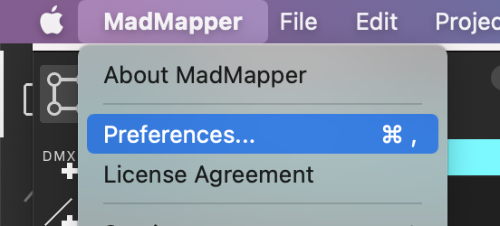

Choisir le boîtier DMX-USB, ici `EnttecPro Out`.

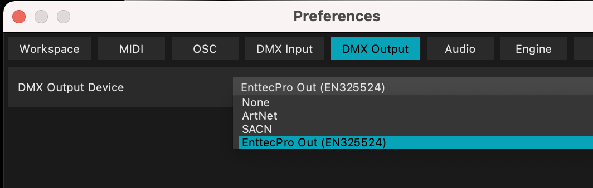

Aller dans l'onglet Fixtures et créer une nouvelle fixture DMX en cliquant sur le bouton `DMX +`.

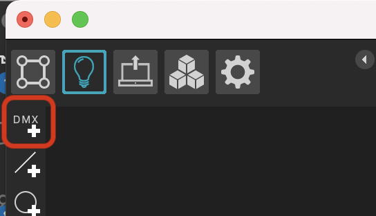

Choisir le channel d'adresse de la light.

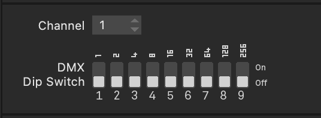

Dans les paramètres de la fixture, on peux ensuite cliquer sur `Edit` dans la partie Fixture Library.

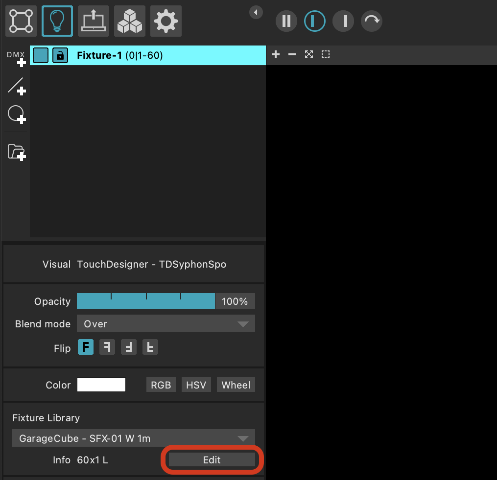

Les paramètres de la fixture apparaîssent :
- la taille en largeur correspondant au nombre de led sur la barre
- la taille en hauteur de 1
- le type de pixel, en fonction du type de LED, RGB
- la taille des pixels qui dépend du type de pixel

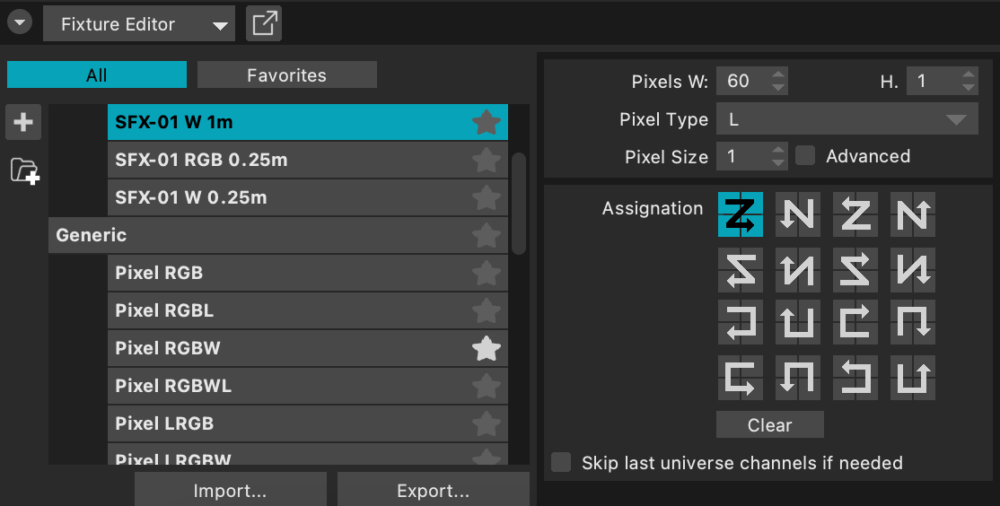

Le nombre de canaux utilisés par la fixture est (nombre de led)*(taille des pixels).

## 2. En Artnet
-->

## 1. En Artnet

### Branchements et mise en réseau

<!-- mettre photo d'une barre led avec boitier artnet -->

 <!--
 TODO faire la section pour windows? en utilisant la balise 

 https://developer.mozilla.org/en-US/docs/Web/HTML/Element/details
 -->

Avec nos boîtiers ("2.0.0.1", "2.0.0.2", "2.0.0.3", "2.0.0.4") + un routeur + le tout relié par des câbles ethernets à l'ordinateur.

Couper la wifi de l'ordinateur pour être uniquement sur le réseau ethernet.

Changer l'adresse IP en `2.0.0.100` et le masque en `255.0.0.0`.
Sous mac, dans les paramètres réseaux:

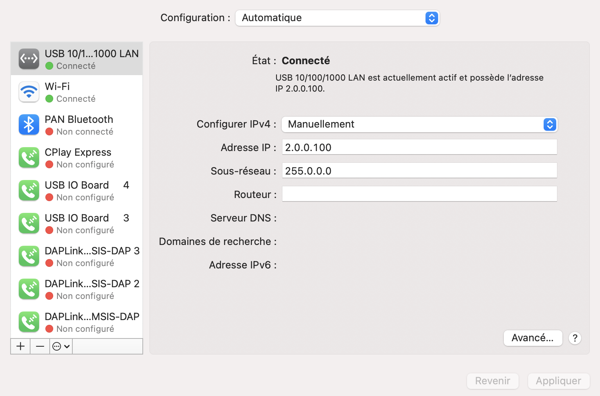

### Mise en place dans Madmapper

Aller dans les préférences MadMapper, dans l'onglet DMX Output.

Pour `DMX Output Device` choisir `Artnet`, et pour `Interface` choisir `Ethernet - 2.0.0.100`.

En cochant `Use Unicast`, les fixtures detectées devraient apparaître : ici LED CTRL 2.
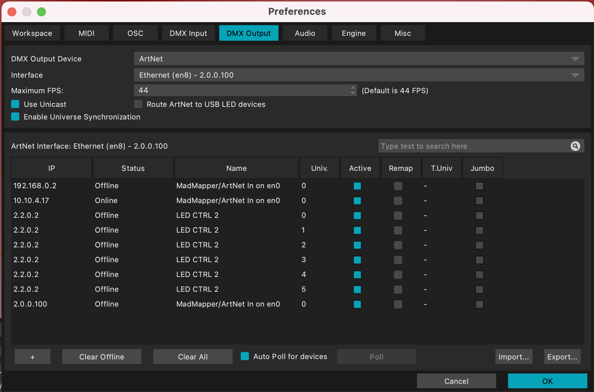

### Créer les fixtures

Aller dans l'onglet Fixtures et créer une nouvelle fixture DMX en cliquant sur le bouton `DMX +`.

Pour les barres de LED de l'atelier, télécharger le fichier `fixture1m.mmfl` ou `fixture_2m.mmfl` en fonction de la taille des barres. Les fichiers sont dans [le dossier `Fixtures_atelier` de ce repo](https://github.com/LucieMrc/Madmapper_PixelMapping/tree/main/fixtures_atelier).

Dans les paramètres de la fixture, on peux ensuite cliquer sur `Edit` dans la partie Fixture Library.

On ouvre ainsi le menu `Fixture Editor`, avec une liste de fixtures pré-définies.
En cliquant sur `Import...`, on peux importer les modèles de fixtures téléchargées.

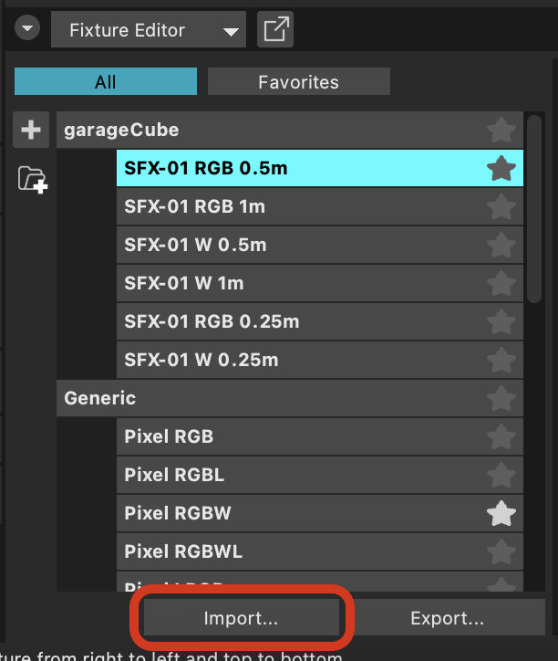

Le modèle des barres de LED apparaît et on a bien :

- la taille en largeur de 120 correspondant au nombre de led sur la barre
- la taille en hauteur de 1
- la taille des pixels de 4, pour RGBW.

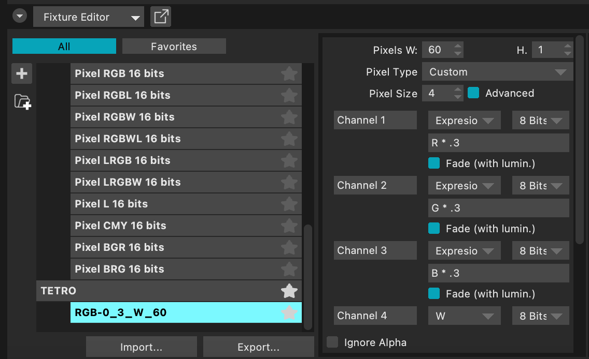

### Mise en place dans l'espace

Dans le cas de 9 barres led à la verticale, mises en place en trois rangs de 3 barres verticales.

Le but est d'envoyer une première texture sur les trois barres de face, une seconde sur les 3 barres du milieu, et une troisième sur les barres du fond.

Barre LED > Barre LED > Barre LED > Boîtier Artnet > câble ethernet > routeur > câble ethernet > ordinateur.

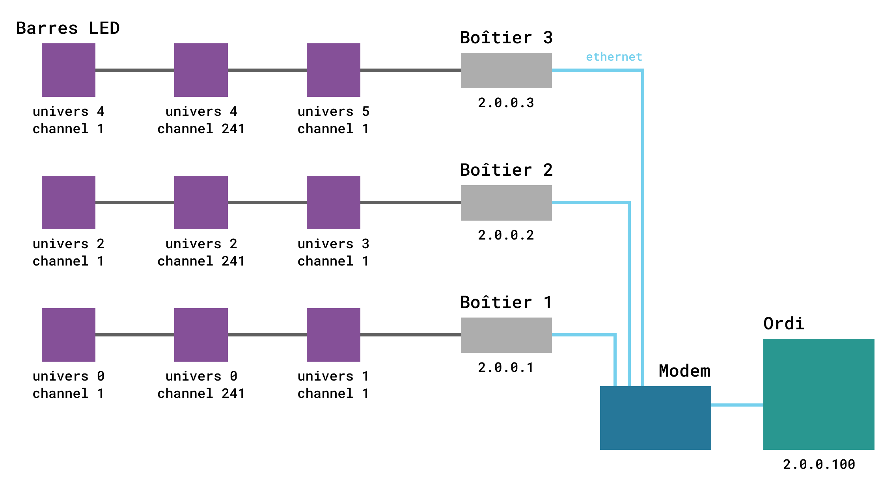

Dans la table de routage Artnet par défaut, dans les output DMX de Madmapper, chaque adresse IP de boîtier renvoie 6 univers (de 0 à 5).

Étant donné que l'on a 3 barres de 60 LEDs sur chaque boîtier, chacun des pixels ayant 4 valeurs (RGBW), 3 * 60 * 4 = 720, cela revient a minimum deux univers DMX.

On laisse donc coché les deux premiers univers de chaque adresse IP, le premier boîtier garde les univers 0 et 1, puis on change le numéro d'univers des autres boîtiers.
Les univers 0 et 1 du boîtier 2 et 3 deviennent donc 2 et 3, et 4 et 5 respectivement.

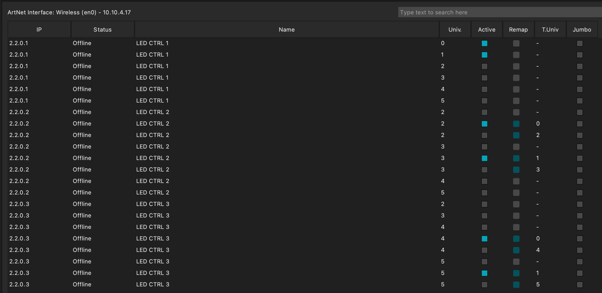

Les seuls univers actifs sont donc 6 univers, de 0 à 5, deux pour chaque boîtier.

Afin d'envoyer la même texture sur les barres trois par trois, on crée une première barre LED avec la fixture importée. L'addresse de la première barre est donc univers 0, channel 1.

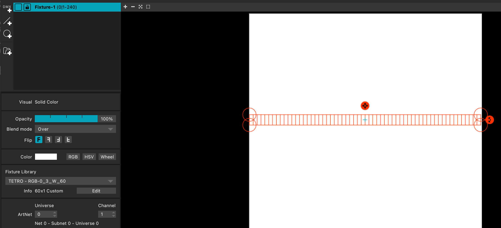

Ensuite, il suffit de copier-coller cette barre deux fois. Les adresses s'enchaînent automatiquement, et il faut placer les barres sur la texture en les collant et les enchaînant.

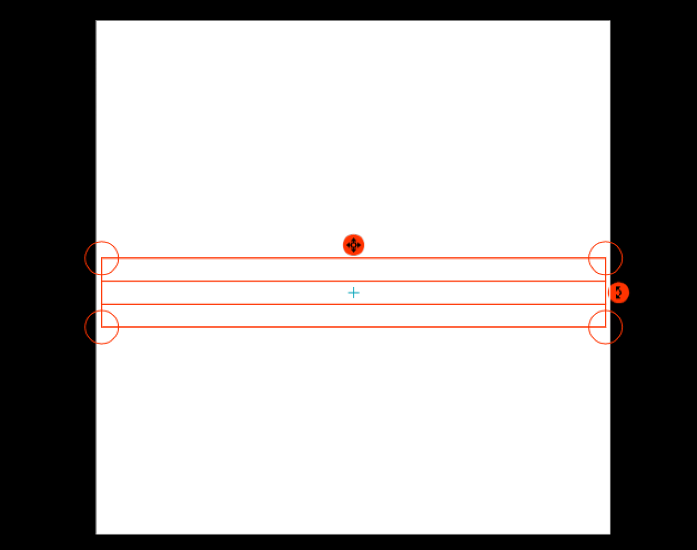

Pour envoyer trois textures sur chaque rang de barres LED, le plus simple est de créer des groupes et envoyer la texture sur le groupe.

Chaque groupe a les adresses suivantes (voir également le synoptique) :

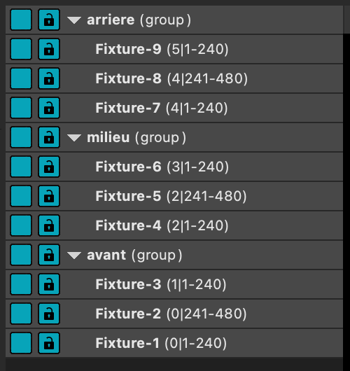

L'interêt de cette disposition est de faire des effets de translation de la texture en profondeur, comme si l'image avançait ou reculait. En mettant donc une texture sur le groupe de barres de devant, la même texture avec un très léger délai sur le groupe de barres du milieu, et encore la même texture avec un léger délai sur le groupe de barres du fond.

L'effet obtenu est un effet de texture qui évolue en 3d, avec un effet très subtil ou très prononcé en fonction du délai entre les textures.

## 2. Communication

Pour envoyer de la vidéo en temps réel depuis TouchDesigner par exemple, on utilise [Spout](https://spout.zeal.co) (sous windows) ou [Syphon](http://syphon.v002.info) (sous mac).
Spout/Syphon permet d'envoyer de la vidéo en temps réel d'un logiciel à un autre.

Pour faire TouchDesigner -> Syphon -> MadMapper, il faut tout d'abord créer un node `Syphon Spout Out` et le placer en sortie de ce qu'on veux envoyer.

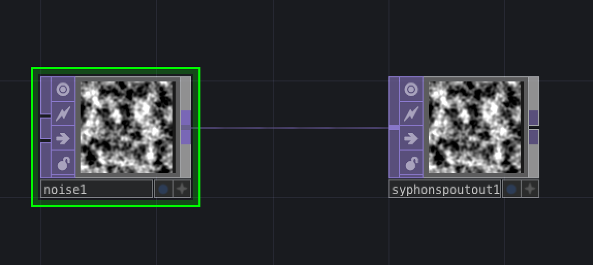

On ouvre ensuite Syphon Recorder, qui détecte directement la sortie vidéo de TouchDesigner.

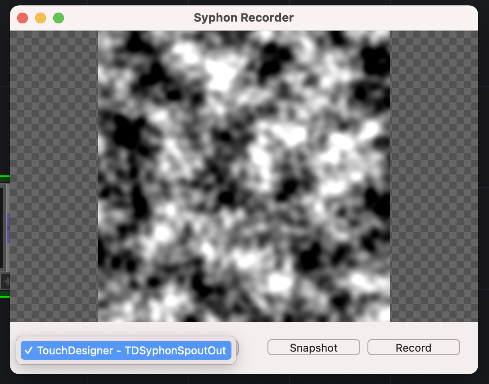

Dans MadMapper, dans l'onglet des textures, une catégorie Syphon apparaît automatiquement et permet de sélectionner la sortie de TouchDesigner.

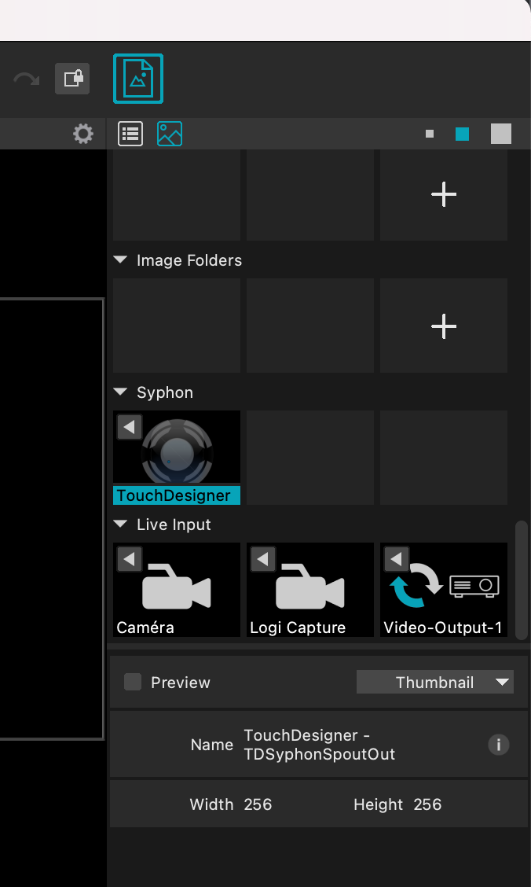

Dans le cas où on veux envoyer trois textures, correspondant à un texture originale, la même avec un délai et la même avec un délai encore supérieure, on peux par exemple créer un `noise` animé, et trois sortie `syphonspoutout`.

On branche le noise tel quel à la première sortie, et on passe par un `cache` pour chacune des deux autres sorties.

On crée l'effet de délai avec le cache en donnant une valeur négative à l'`Output Index` dans les paramètres : ici -20 et -40 pour la sortie 2 et 3 respectivement.

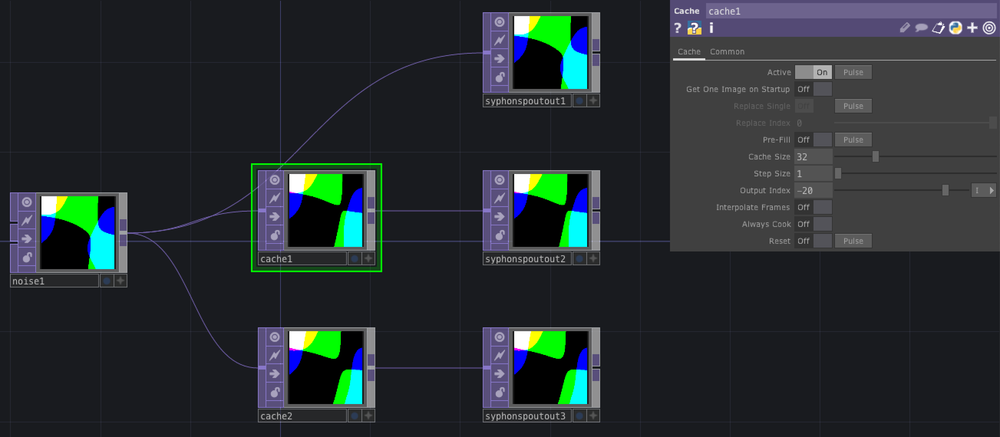

## Pour aller + loin

Le tuto [MadMapper_OSC](https://github.com/LucieMrc/MadMapper_OSC) pour contrôler des paramètres de MadMapper avec des valeurs envoyés en OSC depuis un téléphone.

Le tuto [utilisation du Spatial Scanner](https://github.com/LucieMrc/MadMapper-SpatialScanner-Tuto) pour scanner rapidement des scènes et en sortir une image correspondant à ce que "voit" le projecteur.